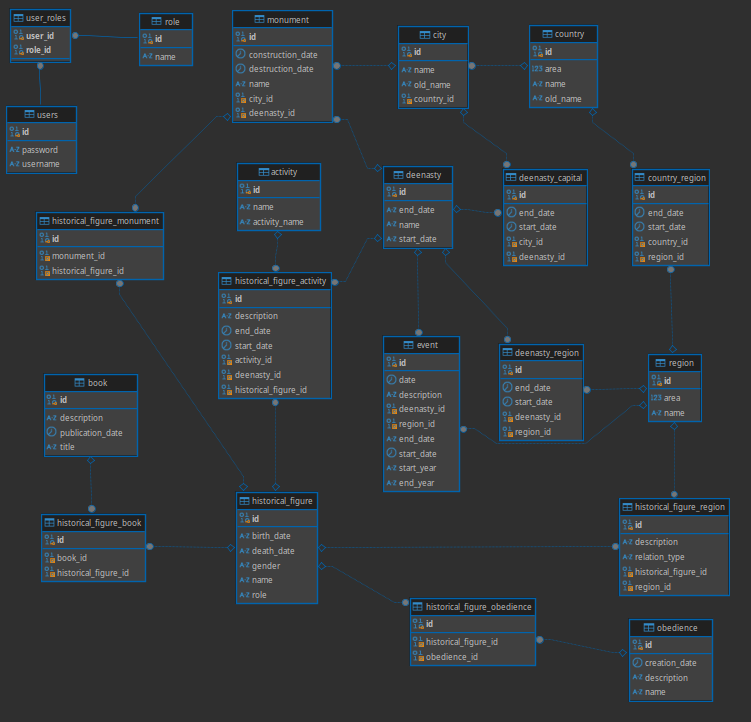

# Deenasty Data API

An open-source API to digitize, verify, and share the legacy of Arab-Muslim civilization.


## 🌍 About the Project

**Deenasty** is a collaborative initiative aimed at digitizing the entire Arab-Muslim civilization, making its rich history, contributions, and culture accessible to all.

This project was born from three key observations:

- Scattered and unverified historical sources  
- A lack of accessible, structured civilizational knowledge  
- A growing interest and the digital capacity to meet that demand  

**Deenasty Data API** is the backend core of this effort — designed to collect, verify, and serve historical, cultural, political, scientific, and societal data via modern and scalable APIs.

## 🚀 Project Goals

- Centralize and standardize historical and cultural data
- Ensure scientific accuracy and traceability of sources
- Provide reliable and open access to educational institutions, app developers, and the general public
- Encourage community contributions through open-source collaboration

## 🛠️ Tech Stack

- **Language:** Java 17+
- **Framework:** Spring Boot / Jakarta EE (TBD)
- **Database:** PostgreSQL (or any relational DB)
- **Documentation:** OpenAPI / Swagger
- **Deployment:** Docker (optional)
- **CI/CD:** GitHub Actions (optional)

## 📁 Project Structure

```bash
Deenasty Data
.
├── docs/                        # Diagrams and documentation
├── src/
│   ├── main/
│   │   ├── java/com/data/deenasty/deenasty_data/
│   │   │   ├── controllers/     # REST Controllers
│   │   │   ├── models/          # JPA Entities
│   │   │   ├── repositories/    # JPA Repository interfaces
│   │   │   ├── services/        # Logique métier
│   │   │   ├── security/        # Security and users management
│   │   │   └── DeenastyDataApplication.java
│   │   └── resources/           # Templates and configuration
│   │       ├── application.properties
│   │       ├── static/
│   │       └── templates/
│   └── test/                    # Unit tests
│       └── java/com/data/deenasty/deenasty_data/
│           └── controllers_tests/
├── pom.xml                      # Maven configuration file
├── README.md                    # Project description
├── CONTRIBUTING.md              # Contribution guide
├── CODE_OF_CONDUCT.md           # Code of conduct
└── logs/                        # Logs repository
```

## 🧱 Architecture Overview

Here is a high-level view of the system:

<p align="center">
  
</p>

## 🧑‍💻 Contributing

We are looking for senior-level contributors who can:

- Maintain and evolve the API (performance, availability, documentation)
- Work on advanced data modeling for historical and cultural sources
- Collaborate with frontend/mobile teams and UX designers
- Build reliable, extensible endpoints to support educational and cultural applications

### Requirements

- Proficiency in Java (Spring, REST APIs)
- Experience working in distributed open-source environments
- Ability to document and test your code properly
- Fluent in English (international team)
- Interest in history, culture, and/or education is a plus!

## 🧪 Getting Started

### Clone the repository

```bash
git clone https://github.com/deenasty/deenasty-data.git
cd deenasty-data
```

### Build the project

```bash
./mvnw clean install
```

### Run the app

```bash
./mvnw spring-boot:run
```

### Access the API

All GET endpoints are available without authentication. For modifying endpoints, a user is created by the **/src/main/java/com/data/deenasty/deenasty_data/security/DataInitializer.java** class ; you can modify from there your default ADMIN user.

## 🗂️ Documentation

API docs (Swagger): http://localhost:8080/swagger-ui.html

Wiki (coming soon)

# 🤝 Join the Project

This is a volunteer, early-stage open-source project. We believe in sharing, rigor, education, and innovation.

Whether you're a developer, designer, historian, or simply curious, you're welcome to contribute or spread the word.

Interested in joining? Contact us or submit a PR!

# 📄 License

This project is licensed under the MIT License. See the LICENSE.md file for details.